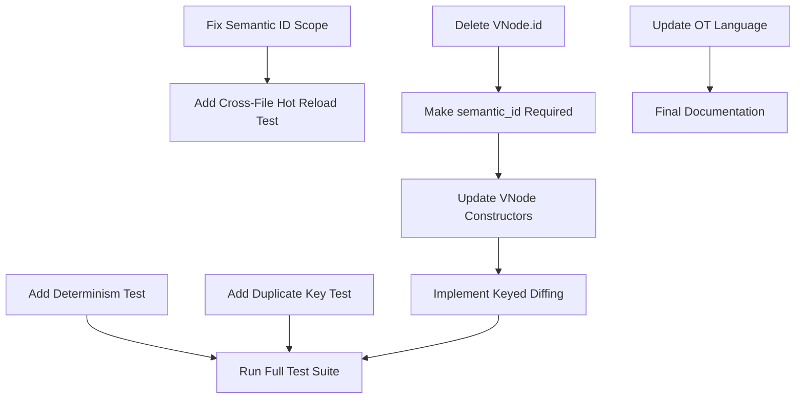

# Architecture Foundation Refactor - Todo List

**Branch**: refactor/architecture-foundation-cleanup
**Plan**: docs/plans/2026-01-29-refactor-architecture-foundation-review-plan.md

## Phase 1: Critical Bugs & Corrections

### 🔴 CRITICAL: Fix Semantic ID Scope Bug
- [ ] **Update semantic ID documentation** - Change from "per-document" to "per-VDOM-tree" scope
  - File: `packages/semantics/src/identity.rs`
  - Add module-level doc explaining evaluation scope vs source scope
- [ ] **Add cross-file hot reload test**
  - File: `packages/evaluator/tests/test_cross_file_hot_reload.rs` (new)
  - Test: Component from file_a imported and used in file_b
  - Verify semantic IDs stable across hot reload of file_a

### 🟠 HIGH: Delete VNode.id Dead Code
- [ ] **Remove VNode.id field entirely**
  - File: `packages/evaluator/src/vdom.rs`
  - Delete `id: Option<String>` field
  - Remove all `id: None` assignments (22 instances)
- [ ] **Delete VNode.with_id() method**
  - File: `packages/evaluator/src/vdom.rs:107-116`
  - Method references deleted field
- [ ] **Update VNode constructor calls**
  - Remove `id` parameter from all VNode::Element creations
  - Grep for `VNode::Element` and clean up

### 🟠 HIGH: Make semantic_id Required
- [ ] **Change semantic_id from Option to required**
  - File: `packages/evaluator/src/vdom.rs`
  - Change `semantic_id: Option<String>` to `semantic_id: String`
- [ ] **Update all VNode creation sites**
  - Ensure semantic_id is always provided
  - Remove `.unwrap()` calls on semantic_id

### 🟡 MEDIUM: Add Critical Missing Tests
- [ ] **Determinism test** (Kieran's finding)
  - File: `packages/evaluator/tests/test_determinism.rs` (new)
  - Test: Same input → byte-identical output
  - Verify counter reset between evaluations
- [ ] **Duplicate key detection test**
  - File: `packages/evaluator/tests/test_repeat_keys.rs` (new)
  - Test: Multiple items with same key in repeat block
  - Should error with helpful message
- [ ] **Slot error recovery test**
  - File: `packages/evaluator/tests/test_error_boundaries.rs` (new)
  - Test: Error in slot content → Error node, not fatal
  - Test: Unknown slot → Fatal error

### 🟢 LOW: Documentation Updates
- [ ] **Update OT claims language**
  - File: Search for "OT-compatible" or "operational transform"
  - Replace with "deterministic, serializable patch protocol (single-writer)"
- [ ] **Update CSS syntax docs**
  - File: `docs/CSS_SYNTAX.md`
  - Document that colons and semicolons ARE required
  - Note inline styles are future work
- [ ] **Document error recovery boundaries**
  - File: `packages/evaluator/src/lib.rs` or `evaluator.rs`
  - Add module docs explaining leaf vs structural boundaries
  - List recoverable: text expressions, style values, attributes, repeat items
  - List fatal: component resolution, repeat source, conditionals, slots

## Phase 2: API Hardening & Enhancements

### 🟡 MEDIUM: Bundle Document Lifetime Rules
- [ ] **Add accessor methods to Bundle**
  - File: `packages/bundle/src/bundle.rs`
  - Add `get_component(&self, path, name) -> Option<&Component>`
  - Add `get_style(&self, path, name) -> Option<&StyleDecl>`
  - Add `get_token(&self, path, name) -> Option<&TokenDecl>`
- [ ] **Document lifetime ownership rules**
  - File: `packages/bundle/src/lib.rs`
  - Explain: Bundle owns Documents, clients borrow temporarily
  - Recommend: Get IDs or copies for long-lived references

### 🟡 MEDIUM: EvalContext Encapsulation
- [ ] **Make EvalContext fields private**
  - File: `packages/evaluator/src/evaluator.rs`
  - Remove `pub` from internal fields (keep document_id public)
  - Already has accessors, just change visibility

### 🟢 LOW: Evaluation Determinism Contract
- [ ] **Document determinism contract**
  - File: `packages/evaluator/src/lib.rs`
  - Add module-level docs with invariants
  - List: No HashMap iteration, no time/random, counter reset
- [ ] **Add lint rule notes**
  - Document (don't implement yet): Forbid std::time, rand in evaluator

## Phase 3: Client-Side Implementation

### 🟠 HIGH: Keyed Diffing in TypeScript Client
- [ ] **Implement keyed diffing algorithm**
  - File: `packages/client/src/differ.ts`
  - Use semantic_id as primary identity
  - Use key for repeat items
  - Build key maps for efficient diffing
- [ ] **Update patch application**
  - File: `packages/client/src/patcher.ts`
  - Route patches by semantic_id
  - Handle key-based updates for repeat blocks

### 🟡 MEDIUM: Enforce Keys for Repeat Blocks
- [ ] **Parser: Require or auto-generate keys**
  - File: `packages/parser/src/parser.rs`
  - Check for key attribute in repeat elements
  - Generate warning if missing, auto-generate from index
- [ ] **Evaluator: Validate unique keys**
  - File: `packages/evaluator/src/evaluator.rs`
  - Track seen keys in repeat evaluation
  - Error if duplicate keys found

## Phase 4: Polish & Validation

### Testing
- [ ] **Run full test suite**
  - Command: `cargo test --workspace`
  - All tests must pass
- [ ] **Run benchmarks**
  - Command: `cargo bench --workspace`
  - No performance regressions

### Documentation
- [ ] **Update ARCHITECTURAL_CONCERNS.md**
  - Mark resolved issues
  - Update with new invariants
  - Reference ARCHITECTURE_CONSTITUTION.md
- [ ] **Create Architecture Decision Log**
  - File: `docs/ADR/001-identity-system.md`
  - Document semantic ID scope decision
  - Document VNode.id deletion decision

### Final Review
- [ ] **Update plan checkboxes**
  - Mark all completed items in plan file
- [ ] **Create comprehensive commit**
  - Include all changes
  - Detailed commit message
  - Reference issues addressed

---

## Dependencies

## Notes
- Recursion protection already complete - verified in evaluator.rs:417-446
- Bundle encapsulation already complete - fields already private
- Focus on actual bugs: semantic ID scope, VNode.id cleanup, missing tests
